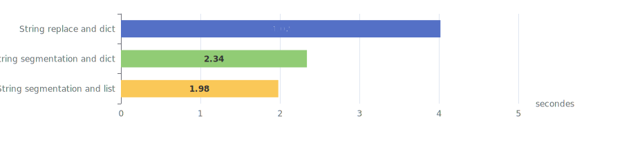
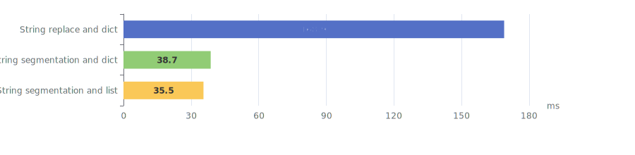

# Rechercher / remplacer optimisé dans un modèle de texte

## Objectif
L'objectif de ce projet est de mesurer l'efficacité de 3 méthodes de recherche et de remplacement dans un modèle de texte afin de produire un mailing.
Le modèle de texte est un fichier HTML contenant des balises (champs) à valoriser par des données provenant d'un fichier xlsx.
Dans le cadre de ce projet de test, le mailing produit par la classe `Mailer`est un simple fichier HTML dans lequel les modèles valorisés sont concaténés.

### Exemple de modèle simple ([simple_template.html](simple_template.html))
```html
un texte avec le champ 3 <b>[---CHAMP3---]</b> et le champ 1 <b>[---CHAMP1---]</b>
et le champ 2 <b>[---CHAMP2---]</b> et à nouveau le champ 1 <b>[---CHAMP1---]</b>
et un texte statique final
```
### Exemple de données ([simple_data.xlsx](simple_data.xlsx))
| CHAMP1         | CHAMP2         | CHAMP3         |
| -------------- | -------------- | -------------- |
| L1 val champ 1 | L1 val champ 2 | L1 val champ 3 |
| L2 val champ 1 | L2 val champ 2 | L2 val champ 3 |

### Exemple de mailing produit (`output.html`)
>un texte avec le champ 3 <b>L1 val champ 3</b> et le champ 1 <b>L1 val champ 1</b>
et le champ 2 <b>L1 val champ 2</b> et à nouveau le champ 1 <b>L1 val champ 1</b>
et un texte statique final<hr>
un texte avec le champ 3 <b>L2 val champ 3</b> et le champ 1 <b>L2 val champ 1</b>
et le champ 2 <b>L2 val champ 2</b> et à nouveau le champ 1 <b>L2 val champ 1</b>
et un texte statique final<hr>

## Méthodes de recherche et de remplacement
### 1. *"String remplace and dictionary"*
Il s'agit d'utiliser la fonction `str.replace()` pour rechercher les balises dans le modèle de texte et
les remplacer par les valeurs correspondantes à partir de chaque ligne du fichier de données xlsx.  

Chaque ligne du fichier xlsx est placée dans un dictionnaire `{nom_champ: valeur}`.

> Cette méthode est implémentée par la méthode `fillOut__withReplace()` de la classe `TemplateManager`.

### 2. *"String segmentation and dictionary"*
Cette méthode consiste à faire un prétraitement du modèle de texte afin de le découper en segments à l'aide de la méthode `str.split()` sur les balises. 
Dans l'exemple du modèle simple ci-dessus, le modèle est découpé en 9 segments dont les 5 premiers sont:  

| Segment                        | Type   |
| ------------------------------ | ------ |
| `un texte avec le champ 3 <b>` | texte  |
| `[---CHAMP3---]`               | balise |
| `</b> et le champ 1 <b>`       | texte  |
| `[---CHAMP1---]`               | balise |
| `</b> et le champ 2 <b>`       | texte  |
| ●●●                            |        |

Ainsi la recherche des balises dans le modèle n'est effectuée qu'une seule fois (avec une regex), puis,
pour chaque ligne du fichier xlsx, on remplit les segments de type balises par les valeurs correspondantes et on retourne la concaténation de tous les segments.

Chaque ligne du fichier xlsx est placée dans un dictionnaire `{nom_champ: valeur}`.

> Cette méthode est implémentée par la méthode `fillOut__withSegmentationAndDict()` de la classe `TemplateManager`.

### 3. *"String segmentationand list"*
Cette méthode est similaire à la méthode 2. La seule différence est que chaque ligne du fichier xlsx est lue comme une simple liste de valeur,
au lieu de créer un dictionnaire `{nom_champ: valeur}`. Cela nécessite une étape préparatoire supplémentaire lors de l'initialisation de la classe `TemplateManager`
pour définir la liste des d'indices des segments de type balise afin de savoir dans quel segment doit être placée chaque valeur de la ligne xlsx.

> Cette méthode est implémentée par la méthode `fillOut__withSegmentationAndList()` de la classe `TemplateManager`.

## Résultats
Les mesures ont été effectuées sur un MacBook Pro M4 MAX avec Python 3.13.

### Tests unitaires des 3 méthodes de la classe `TemplateManager`

#### Temps d'exécution pour 10 000 000 d'exécutions individuelle des méthodes de remplissage des balises
Pour ces tests, on a utilisé 3 balises contenant chacune une valeur de 13 caractères.


### Tests glabaux de génération du mailing

#### Temps d'exécution pour un modèle comportant 10 balises et 11 277 lignes de données
Dans ces tests, on avait 10 balises entre 0 et 384 caractères, pour un total de 959 caractères par ligne.  
On voit, que le nombre de balises et la longueur des valeurs a un impact significatif sur le temps d'exécution de la méthode 1.
